# ARAssistant — AI 虛擬學習助理與 AR 引導式概念圖學習系統

> **國科會大專生研究計畫** | NSTC 114-2813-C-031-057-E  
> 東吳大學 資料科學系 ｜ 指導教授：金凱儀 教授

---

## 專案簡介

本系統結合**擴增實境（AR）** 與 **生成式 AI（Gemini）**，開發一套應用於物聯網程式設計課程的互動式行動學習平台。

學生在學習 Webduino / Arduino 物聯網概念時，常面臨邏輯抽象、缺乏即時引導等挑戰。本研究開發的系統以 **運算思維四步驟**（拆解、樣式辨識、抽象化、演算法設計）為核心框架，透過 3D AI 虛擬學習助理引導學生逐步完成概念構圖，並以 AR 技術將數位提示疊映於實體學習單上，打造虛實整合的沉浸式學習體驗，有效降低認知負荷並提升學習成效與動機。

---

## 系統架構

```
行動裝置（Android）
├── Unity 3D Engine
│   ├── Vuforia SDK          ← AR 圖像辨識與疊映
│   ├── VRoid Studio         ← 3D 虛擬角色
│   └── C# Scripts           ← 核心邏輯
├── Gemini API               ← 大語言模型（問答 / 學習單批改）
├── Google Cloud STT         ← 語音轉文字
├── Google Cloud TTS         ← 文字轉語音
└── Firebase                 ← 即時資料庫 / 學習歷程儲存
```

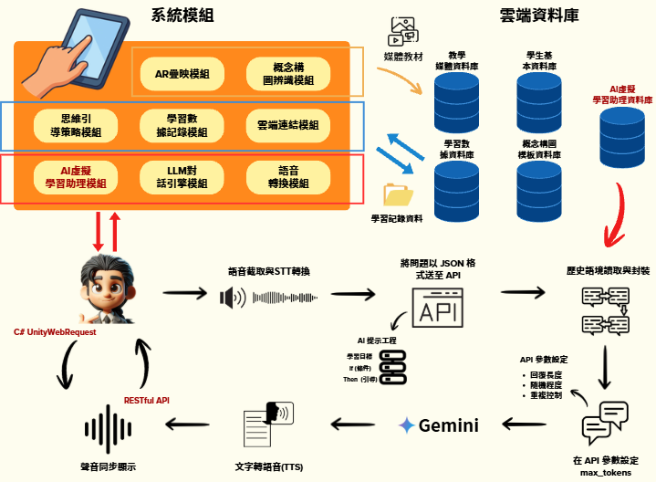

---

## 主要功能

### 1. AR 引導式概念構圖

透過行動裝置掃描實體學習單，分三階段在紙本上疊映 AR 提示面板，為學生提供階段性學習鷹架：

| 階段 | 掃描區塊 | AR 提示內容 |
|------|----------|-------------|
| 第一階段 | 專案主題 | 提供感應燈、溫度感測器、防盜鈴等主題建議 |
| 第二階段 | 拆解問題 / 樣式辨識 | 引導選擇輸入感測器與輸出作動器 |
| 第三階段 | 抽象化 / 演算法 | 提供 If-Then-Else 邏輯造句範例 |

**Webduino 學習單 ／ Arduino 學習單**

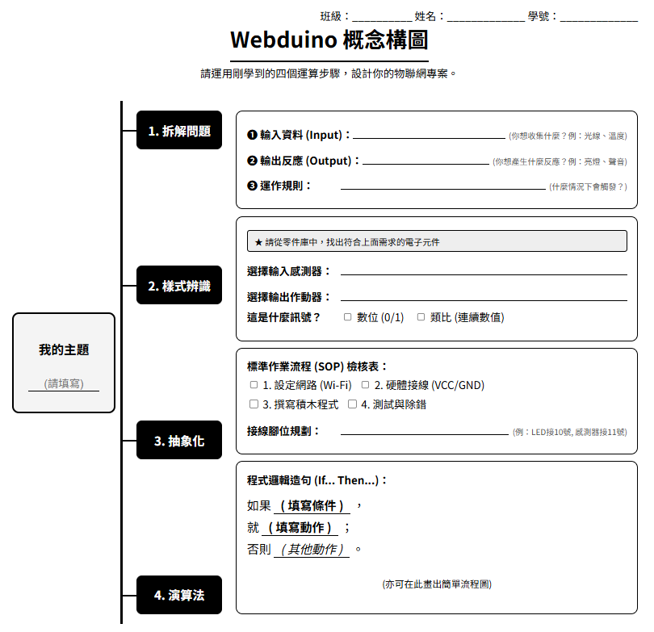
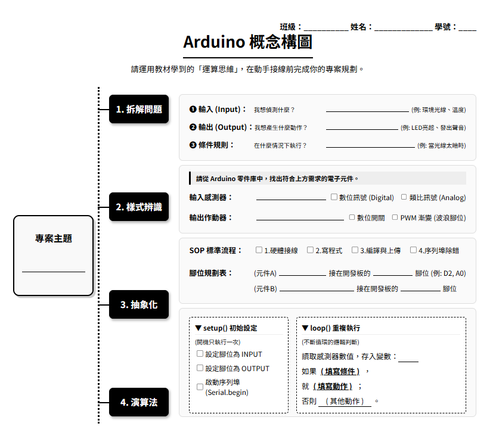

**AR 三階段提示面板（疊映於實體學習單）**

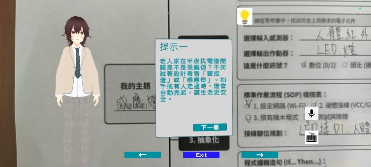 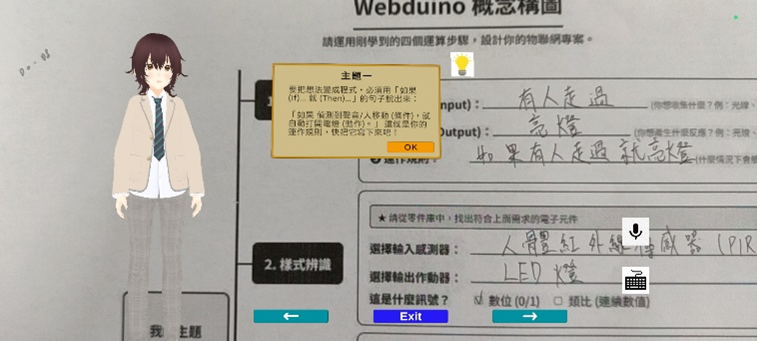 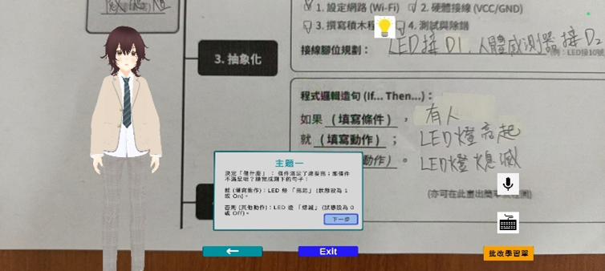

### 2. AI 虛擬學習助理

- 以 3D 虛擬角色具象化 AI 助理，提供即時問答與引導
- **雙軌制對答機制**：語音輸入（長按錄音）+ 文字打字輸入
- 串接 Gemini 大語言模型，結合學習歷程封裝提供個人化回饋
- AI 語音回覆同步轉為對話框文字顯示，降低聽覺負擔

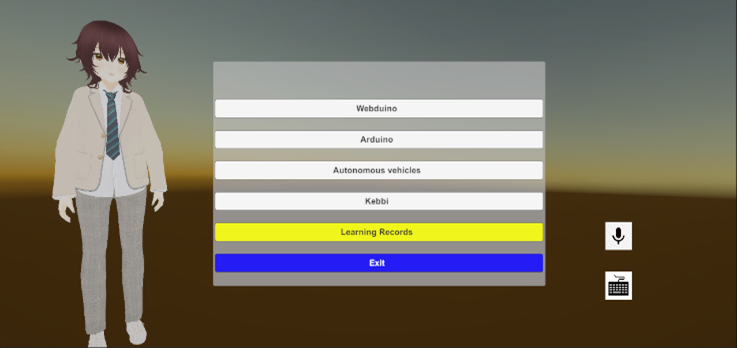 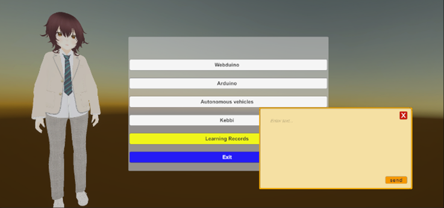

### 3. 先備知識教材

- 提供 Webduino / Arduino 圖文並茂的教學教材
- 說明硬體元件特性、感測器原理及操作注意事項
- 幫助學生在進入概念構圖前建立穩固的知識基礎

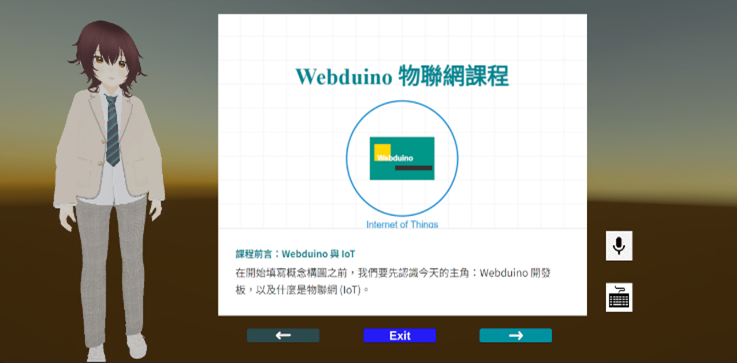 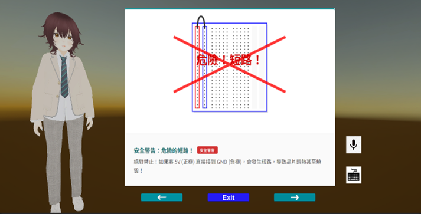

### 4. AI 批改學習單

- 學生拍攝完成的學習單後，由 Gemini 自動解析與批改
- 針對拆解問題、樣式辨識、抽象化、演算法邏輯逐一檢核
- 即時提供修改建議，循環批改直至概念邏輯完全正確

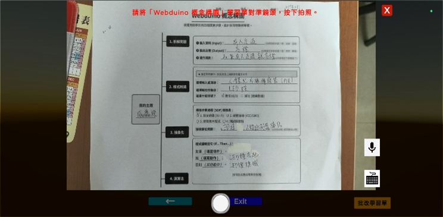 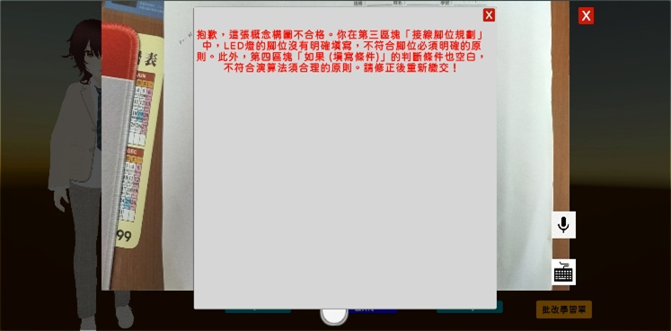

### 5. 課後練習題

- 共 10 題（選擇題 / 是非題），滿分 100 分
- 答錯立即顯示正確答案及針對錯誤選項的解析（正誤雙向解析）

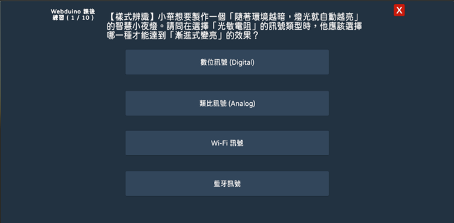 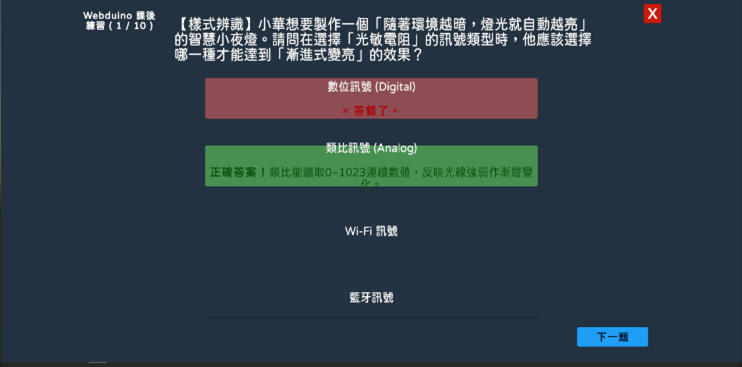

### 6. 學習歷程紀錄

- 自動彙整各階段行為數據，回傳學習歷程儀表板
- 記錄各步驟停留時間、AI 批改歷史、課後測驗錯題分析
- 完整保存與 AI 虛擬助理的雙向對話紀錄

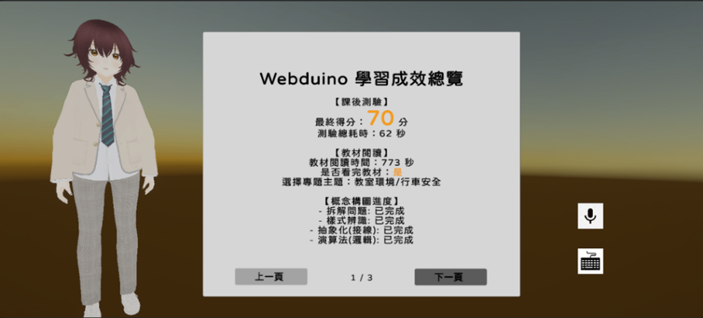 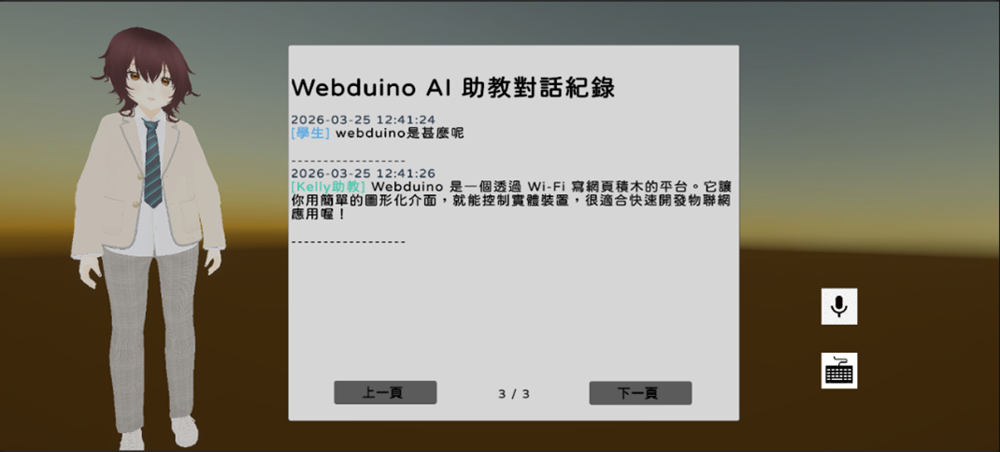

---

## 使用技術

| 技術 | 版本 / 說明 |
|------|-------------|
| Unity | Android 平台主開發環境 |
| Vuforia Engine | AR 圖像辨識 SDK |
| Google Gemini API | 大語言模型：問答引導、學習單批改 |
| Google Cloud Speech-to-Text | 語音辨識（STT） |
| Google Cloud Text-to-Speech | 語音合成（TTS） |
| Firebase Realtime Database | 雲端學習歷程資料儲存 |
| Firebase Authentication | 使用者身份驗證 |
| VRoid Studio | 3D 虛擬角色建立 |
| Mixamo | 角色動畫資源 |
| C# | Unity 腳本撰寫語言 |

---

## 研究成果

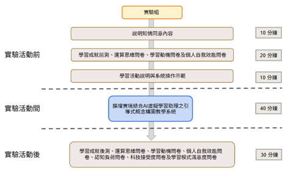

本系統經 **9 位大三學生**之單組前後測實驗驗證（相依樣本 t 檢定）：

| 測量指標 | 前測平均 | 後測平均 | 結果 |
|----------|----------|----------|------|
| 演算法設計（Q3）| 32.22 | 36.11 | **顯著提升** *(p = 0.038)* |
| 運算思維傾向 | 3.57 | 4.07 | **顯著提升** *(p = 0.022)* |
| 整體學習動機 | 3.96 | 4.35 | **顯著提升** *(p = 0.007)* |
| 內在學習動機 | 3.52 | 4.11 | **極顯著提升** *(p = 0.001)* |
| 科技接受度（有用性）| — | 4.20 / 5 | 高度肯定 |
| 科技接受度（易用性）| — | 4.33 / 5 | 高度肯定 |
| 學習模式滿意度 | — | 4.25 / 5 | 高度肯定 |

> 本次實驗為**試驗性研究（Pilot Study）**，以同年級學生驗證系統可用性，並依結果完成系統優化。後續研究計畫將擴大規模，以大一學生（100+ 人）進行正式對照實驗，進一步驗證系統成效。

> **研究成果發表：**  
> 1. 陳紀宇, 金凱儀. (2025). 結合 AI 虛擬學習助理與 AR 引導式概念圖的程式設計學習系統. *第二十一屆台灣軟體工程研討會（TCSE 2025）*，高雄，台灣。  
> 2. *AI-MetaACES 2026, APSCE TBICS Festival of Learning  2026*（已錄取） 

---

## 安裝與環境設定

### 前置需求
- Unity 2022.x（需安裝 Android Build Support 模組）
- Vuforia Engine SDK
- Android SDK（API Level 28+）

### 1. API 金鑰設定

本專案透過 `SecretLoader.cs` 從外部檔案讀取 API 金鑰，**金鑰不內嵌於程式碼中**。

請在專案根目錄（與 `Assets/` 同層）建立 `secrets.json`：

```json
{
  "gemini_api_key": "YOUR_GEMINI_API_KEY",
  "google_cloud_api_key": "YOUR_GOOGLE_CLOUD_API_KEY"
}
```

- **Gemini API Key**：前往 [Google AI Studio](https://aistudio.google.com/) 申請
- **Google Cloud API Key**：前往 [Google Cloud Console](https://console.cloud.google.com/) 申請，需啟用 Speech-to-Text 及 Text-to-Speech API

### 2. Firebase 設定

1. 前往 [Firebase Console](https://console.firebase.google.com/) 建立新專案
2. 新增 Android 應用程式
3. 下載 `google-services.json` 並放入 `Assets/` 資料夾（此檔案已加入 `.gitignore`，不會上傳至 GitHub）

### 3. Vuforia 設定

1. 前往 [Vuforia Developer Portal](https://developer.vuforia.com/) 申請 License Key
2. 在 Unity 中開啟 `Window > Vuforia Configuration`，填入你的 License Key

---

## 專案結構

```
Assets/
├── scripts/                   ← 核心自訂腳本
│   ├── ARCharacterLoop.cs     ← AR 角色互動流程
│   ├── FirebaseManager.cs     ← Firebase 資料管理
│   ├── MainScene.cs           ← 主場景控制
│   ├── QuizManager.cs         ← 課後練習題模組
│   ├── WorksheetGrader.cs     ← AI 批改學習單
│   ├── SlideVideoController.cs← 教材簡報控制
│   ├── SpeechToTextData.cs    ← 語音辨識資料結構
│   └── VoiceButton.cs         ← 語音按鈕控制
├── GeminiManager/             ← Gemini AI 整合模組
│   ├── UnityAndGeminiV3.cs    ← Gemini API 串接
│   ├── SpeechToTextManager.cs ← STT 管理器
│   ├── TextToSpeechManager.cs ← TTS 管理器
│   └── SecretLoader.cs        ← API 金鑰載入器
├── Arduinoclassimage/         ← Arduino 課程教材圖片
├── Webduinoclassimage/        ← Webduino 課程教材圖片
├── 3D-Model/                  ← 3D 模型與動畫資源
├── Firebase/                  ← Firebase Unity SDK
└── VRoid/                     ← 3D 虛擬角色模型
```

---

## 研究計畫資訊

| 項目 | 內容 |
|------|------|
| 計畫名稱 | 運用AI虛擬學習助理與AR引導式概念圖於程式設計學習以強化運算思維與學習成效 |
| 計畫編號 | NSTC 114-2813-C-031-057-E |
| 執行期間 | 2025/07/01 — 2026/02/28（8 個月） |
| 執行學生 | 陳紀宇 |
| 指導教授 | 金凱儀 教授 |
| 執行單位 | 東吳大學 資料科學系 |

---

## Credits

- **[Adobe Mixamo](https://www.mixamo.com/)** — 本專案使用 Mixamo 提供的免費 3D 角色動畫資源（Walking 行走動畫），感謝 Adobe Mixamo 對開發者社群的貢獻。
- **[VRoid Studio](https://vroid.com/en/studio)** — 3D 虛擬角色建立平台
- **[Google Gemini](https://deepmind.google/technologies/gemini/)** — 大語言模型 API
- **[Vuforia Engine](https://developer.vuforia.com/)** — AR 圖像辨識 SDK
- **[Firebase](https://firebase.google.com/)** — 雲端資料庫與身份驗證服務
- **[Gemini Unity Package](https://github.com/UnityGameStudio/Gemini-Unity-Package)** — Gemini API Unity 整合套件，MIT License © 2024 UnityGameStudio

---

## License

MIT License © 2026 CHI-YU, CHEN (HenryChen940219)
